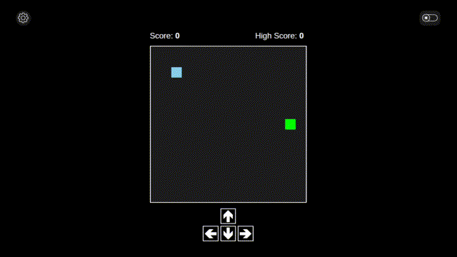

# Xeno

### About Me

I started learning web development over 1.5 years ago. After taking a break, I'm now focused on **building practical projects** to sharpen my skills.

---

### Latest Project: **Trail Builder**

#### **[Play it here](https://trail-builder.netlify.app/)** | **[Full Project](https://github.com/xenoleads/trail-builder)**

A snake-like game built from scratch with **HTML Canvas**. Control a block, collect items, and grow your trail while avoiding collisions. My first full project exploring game development fundamentals.

**Key Features:** Smooth movement mechanics • Trail growth system • Collision detection • Multiple control schemes

### Other Project: **Weather Web App**

#### **[Live Preview](https://xeno-weather.netlify.app/)** | **[Full Project](https://github.com/xenoleads/weather-app)**

A responsive weather app demonstrating **API integration**, **geocoding**, and clean UI design.

---

### Let's Connect

> _“The best way to learn is by doing.”_

---
